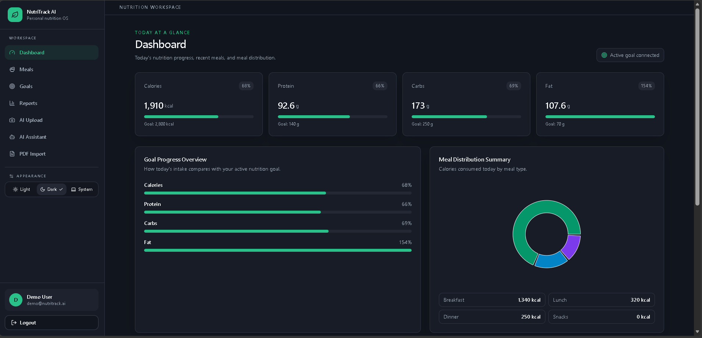
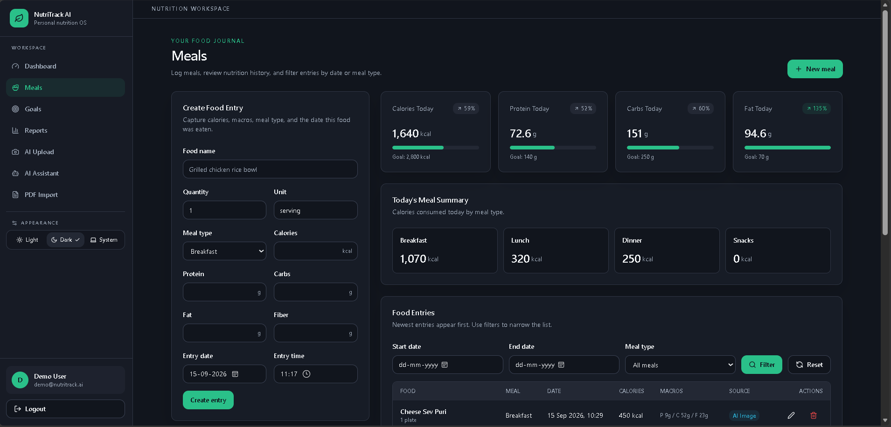
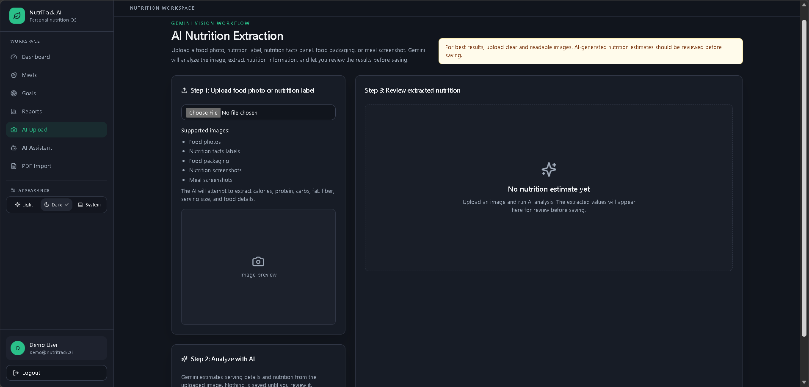
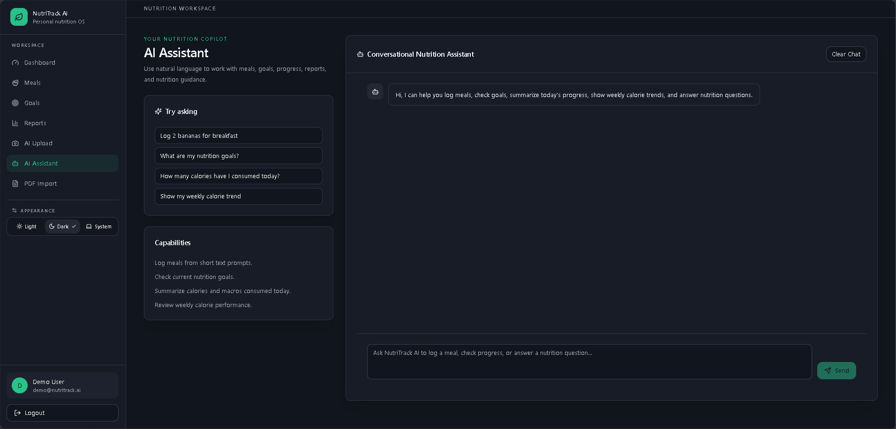
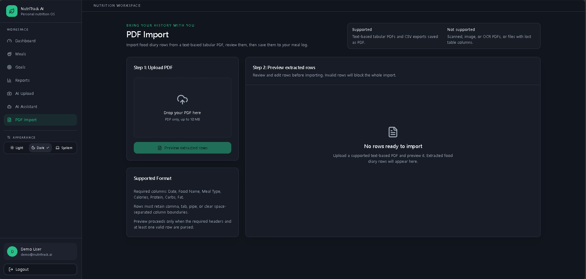
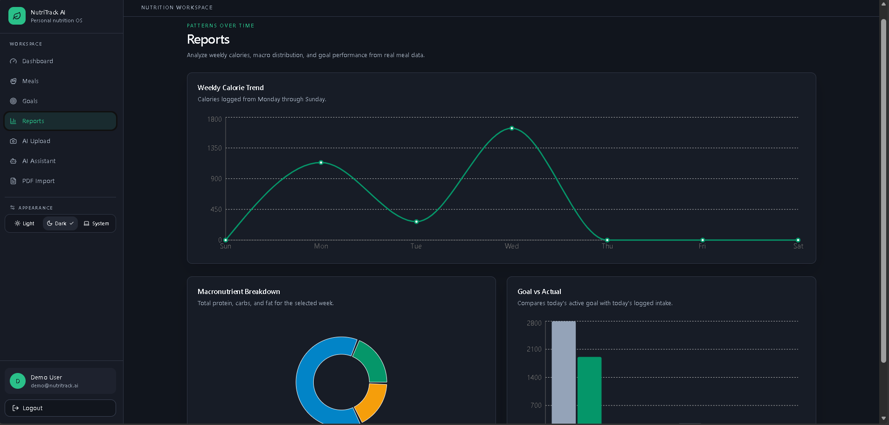
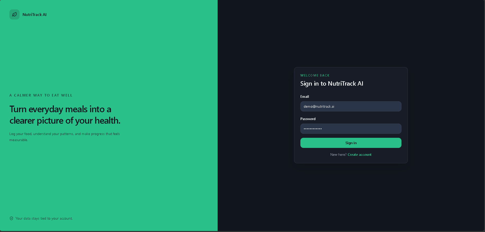
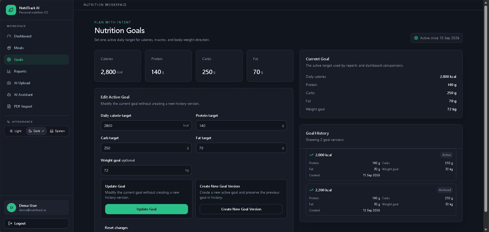
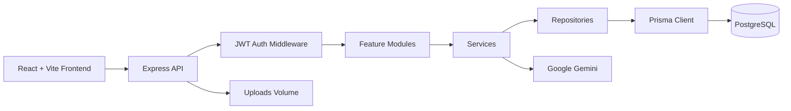

# NutriTrack AI

<p align="center">
  <strong>A focused nutrition workspace for goals, meals, insights, and AI-assisted logging.</strong><br />
  Track what you eat, understand your progress, and keep your nutrition history organized in one place.
</p>

<p align="center">
  <a href="#features"></a>
  <a href="#technology-stack"></a>
  <a href="#technology-stack"></a>
  <a href="#database-schema"></a>
  <a href="#docker-setup"></a>
</p>

## Overview

NutriTrack AI is a full-stack nutrition tracking application built around a simple workflow: define nutrition goals, record meals, review progress, and learn from trends. It combines conventional food logging with Gemini-powered image analysis, a conversational assistant, and structured PDF diary import.

The project is designed as a practical SaaS-style MVP with authenticated, user-scoped data; a modular Express backend; a responsive React interface; and a PostgreSQL database managed through Prisma.

## Problem It Solves

Nutrition data is often split between notes, screenshots, food labels, spreadsheets, and disconnected tracking tools. NutriTrack AI brings those inputs into one reviewable meal log while keeping the user in control of AI-generated estimates and imported records.

## Demo Video

[Watch the NutriTrack AI Demo](assets/demo/final%20demo%20video.mp4)

## Project Gallery

The gallery below highlights the main product screens.

| Dashboard | Meal Tracking |
| --- | --- |
|  |  |

| AI Nutrition Review | AI Assistant |
| --- | --- |
|  |  |

| PDF Import | Reports |
| --- | --- |
|  |  |

See the full screenshot set in [Screenshots](#screenshots).

## Features

### Authentication and Account Security

- User registration and login with JWT bearer authentication.
- Password hashing with bcrypt.
- Protected frontend routes and authenticated API routes.
- Current-user lookup and user-scoped data access.
- Logout clears the browser session and local AI Assistant chat history.

### Nutrition Goal Management

- Create an active daily nutrition goal.
- Update the current goal without creating a history version.
- Create a new goal version while archiving the previous active goal.
- View active and historical goals.
- Confirmation dialogs for goal updates and new versions.
- Duplicate-version warning when submitted values match the active goal.

### Food Entry Management

- Create, list, inspect, edit, and delete meal entries.
- Track food name, quantity, unit, meal type, calories, protein, carbs, fat, fiber, and entry timestamp.
- Separate date and 24-hour time inputs with future-date/time validation.
- Date filtering, meal-type filtering, pagination, and responsive meal views.
- Immutable origin metadata for `MANUAL`, `AI_IMAGE`, `AI_ASSISTANT`, and `PDF_IMPORT` entries.
- Source badges remain visible after an entry is edited.
- Human-readable 24-hour timestamps without seconds.

### AI Nutrition Extraction

- Upload food photos, nutrition labels, nutrition facts panels, food packaging, or meal screenshots.
- Gemini analyzes the image and returns estimated food and nutrition values.
- Review extracted values before saving.
- Editable entry date and time with the same future timestamp rules as manual entry.
- Saved image-derived entries use `source = AI_IMAGE`.
- Successful saves show feedback and reset the selected file, preview, result, and form.
- Extraction failures retain a specific diagnostic reason in backend records and logs.

### AI Assistant

- Gemini-backed intent classification for supported nutrition workflows.
- Conversational meal creation with explicit date/time parsing.
- Support for 12-hour and 24-hour time input, normalized before storage.
- Nutrition goal and current-progress responses with percentages and exceeded amounts.
- Weekly calorie reports based on stored food entries.
- Actual meal listing for today, yesterday, date ranges, last seven days, and this week.
- LocalStorage persistence for the latest 50 messages per user.
- Clear Chat action and automatic scroll within the message panel.
- Assistant-created entries use `source = AI_ASSISTANT`.

### PDF Import

- Upload a text-based tabular food diary PDF.
- Preview parsed rows before confirmation.
- Responsive editable meal cards instead of a horizontally scrolling spreadsheet.
- Supports structured delimiters and deterministic meal-type-anchored rows when separators are lost.
- Editable food name, meal type, date, calories, protein, carbs, and fat.
- Row-level validation, imported-row count, and total-calorie summary.
- PDF-created entries use `source = PDF_IMPORT`.
- Development diagnostics expose extracted text, detected headers, parsed rows, DTOs, and final database payloads.

### Dashboard

- Today’s calories and macro totals.
- Goal targets and percentage progress.
- Meal-type calorie breakdown.
- Recent meal list with source and timestamp information.

### Reporting and Analytics

- Weekly calorie trend charts.
- Macro breakdown charts for protein, carbs, and fat.
- Actual-versus-goal comparison for a selected date.
- Chat weekly reports with total calories, average daily calories, macros, and meal count.

### Theme and Responsive Design

- Light, dark, and system theme modes.
- Theme preference persisted in localStorage.
- Responsive layouts for desktop, tablet, and mobile.
- Desktop sidebar navigation and mobile navigation bar.
- Responsive meal cards, PDF review cards, forms, charts, and chat layout.

## Screenshots

### Login Page



### Dashboard


### Goals Management



### Meal Tracking


### AI Nutrition Analysis


### AI Assistant


### PDF Import


### Reports and Analytics


## Technology Stack

### Frontend

- React 19, TypeScript, Vite, Tailwind CSS
- React Router and Recharts
- Radix UI primitives, shadcn-style components, and Lucide icons

### Backend

- Node.js, Express 5, and TypeScript
- Joi validation, Multer uploads, Helmet, CORS, and Morgan

### Data and Integrations

- PostgreSQL 16 and Prisma ORM 6
- Google Gemini through `@google/generative-ai`
- `pdf-parse` for text extraction
- Docker and Docker Compose

## System Architecture



The backend follows a modular monolith pattern:

```text
HTTP request
  -> Route
  -> Auth / validation middleware
  -> Controller
  -> Service
  -> Repository
  -> Prisma
  -> PostgreSQL
```

## API Documentation

The API is prefixed with `/api` and returns the standard `{ success, data, message }` response shape.

### Public Endpoints

| Method | Endpoint | Purpose |
| --- | --- | --- |
| `GET` | `/api/health` | Health check |
| `POST` | `/api/auth/register` | Register a user |
| `POST` | `/api/auth/login` | Log in and receive a JWT |
| `GET` | `/api/docs` | Swagger UI |

### Authenticated Endpoint Groups

| Area | Endpoints |
| --- | --- |
| Goals | `/api/goals/current`, `/api/goals/history`, `/api/goals` |
| Food entries | `/api/food-entries`, `/api/food-entries/:id` |
| Dashboard | `/api/dashboard/summary` |
| Reports | `/api/reports/weekly-calories`, `/macro-breakdown`, `/goal-comparison` |
| AI | `/api/ai/extract-nutrition`, `/api/ai/save-entry` |
| Assistant | `/api/chat/message` |
| PDF import | `/api/pdf-import/preview`, `/api/pdf-import/confirm` |

Protected routes expect:

```http
Authorization: Bearer <jwt>
```

### Swagger / OpenAPI

With the backend running, open:

```text
http://localhost:5000/api/docs
```

The interactive Swagger UI is generated from `backend/src/config/swagger.ts` and documents authentication, goals, food entries, dashboard, reports, AI, chat, and PDF import endpoints.

## Database Schema

Prisma schema: `backend/prisma/schema.prisma`

### Models

- `User`: account identity and ownership root.
- `NutritionGoal`: active and historical calorie/macro targets.
- `FoodEntry`: timestamped meals and immutable origin source.
- `AiExtraction`: image extraction lifecycle, raw response, normalized nutrition, and failure details.

### Enums

- `MealType`: `BREAKFAST`, `LUNCH`, `DINNER`, `SNACKS`
- `EntrySource`: `MANUAL`, `AI_IMAGE`, `AI_ASSISTANT`, `PDF_IMPORT`
- `AiExtractionStatus`: `PENDING`, `SUCCESS`, `FAILED`

Food entries are indexed by user/date and user/meal type. Goals are indexed by user/active status. AI extractions are indexed by user/creation time. User-owned records cascade when a user is deleted.

### Source Provenance

Source is assigned by the creation workflow and is not changed during edits:

| Workflow | Stored source |
| --- | --- |
| Manual form | `MANUAL` |
| AI image extraction | `AI_IMAGE` |
| AI Assistant | `AI_ASSISTANT` |
| PDF import | `PDF_IMPORT` |

## Local Development

### Prerequisites

- Node.js and npm
- Docker Desktop, or PostgreSQL 16 running locally
- Gemini API key for AI image and assistant features

### Setup

From the repository root:

```bash
npm install
docker compose up postgres
npm run prisma:generate
npm run prisma:migrate
npm run prisma:seed --workspace backend
npm run dev
```

Create or update `backend/.env` with the values described in [Environment Variables](#environment-variables). Do not commit real secrets.

The seed includes:

```text
Email:    demo@nutritrack.ai
Password: Password@123
```

Local URLs:

| Service | URL |
| --- | --- |
| Frontend | `http://localhost:5173` |
| Backend API | `http://localhost:5000` |
| Swagger UI | `http://localhost:5000/api/docs` |
| PostgreSQL | `localhost:5432` |

### Useful Commands

```bash
npm run build
npm run lint
npm run format
npm run test --workspace backend
npm run prisma:studio --workspace backend
```

## Docker Setup

```bash
docker compose up --build
```

Docker Compose starts PostgreSQL 16 Alpine and the production backend. PostgreSQL uses a persistent `postgres_data` volume and a health check; the backend waits for PostgreSQL and exposes port `5000`. Uploaded files are mounted from `./backend/uploads`.

The frontend is not containerized by the current Compose file. Run it locally with `npm run dev` or deploy it separately. The backend image generates Prisma Client and builds TypeScript, but migrations should be applied explicitly for a fresh or production database:

```bash
npx prisma migrate deploy --schema backend/prisma/schema.prisma
```

## Environment Variables

Backend configuration is loaded from `backend/.env`.

| Variable | Required | Description |
| --- | ---: | --- |
| `DATABASE_URL` | Yes | PostgreSQL connection string |
| `JWT_SECRET` | Yes | Secret used to sign access tokens |
| `JWT_EXPIRES_IN` | No | JWT lifetime; defaults to `7d` |
| `GEMINI_API_KEY` | AI features | Google Gemini API key |
| `GEMINI_MODEL` | No | Defaults to `gemini-3.6-flash` |
| `PORT` | No | Backend port; defaults to `5000` |
| `CLIENT_ORIGIN` | No | Allowed frontend origin; defaults to `http://localhost:5173` |
| `VITE_API_BASE_URL` | Frontend | Frontend API base URL; defaults to `http://localhost:5000/api` |

Never commit real passwords, JWT secrets, API keys, or production database URLs.

## Security Considerations

- JWT bearer authentication protects application routes.
- bcrypt hashes passwords before persistence.
- Joi validates API payloads and strips unknown fields.
- User-owned data is scoped by authenticated user ID.
- Helmet adds security headers and CORS is configurable.
- Uploads are limited by type/extension and size.
- Food entry timestamps reject future values.
- Source provenance is server-controlled and immutable during edits.
- Prisma relations enforce user ownership and cascading cleanup.

Production hardening still recommended:

- Move JWT storage from browser localStorage to a stronger cookie-based session strategy.
- Add rate limiting and abuse controls.
- Add malware scanning, authenticated asset delivery, retention policies, and object storage for uploads.
- Use production secrets instead of Docker Compose placeholders.
- Add observability, audit logging, and automated dependency/security scanning.

## Known Limitations

- PDF import targets structured, text-based tabular PDFs and CSV exports saved as PDF. Extraction behavior varies by PDF generator and fails when table boundaries are lost.
- Scanned PDFs, image-only PDFs, OCR PDFs, and complex layouts are not supported.
- Gemini nutrition values are estimates and should be reviewed before saving.
- AI features require a valid Gemini API key and available configured model.
- The assistant uses supported intent workflows rather than general-purpose conversation.
- Chat persistence is browser-local and limited to the latest 50 messages; it is not server-side history.
- Uploaded files are stored on disk without a complete retention, malware-scanning, or object-storage lifecycle.
- No barcode scanning, food database lookup, export workflow, or advanced personalized analytics is implemented.
- Docker Compose does not run database migrations automatically.
- Automated test coverage is currently focused and is not a full end-to-end suite.

## Future Improvements

- OCR support for scanned and image-only PDFs.
- More robust table extraction for complex PDF layouts.
- Server-side conversation history with retention and search.
- Multi-user analytics and cohort insights.
- CSV, PDF, and spreadsheet export functionality.
- Enhanced reporting with trends, comparisons, and personalized recommendations.
- Barcode scanning and packaged-food integrations.
- Production-grade upload storage, processing queues, and observability.

## Project Structure

```text
.
├── backend/
│   ├── prisma/
│   │   ├── migrations/
│   │   ├── schema.prisma
│   │   └── seed.ts
│   ├── src/
│   │   ├── config/                 # Environment, Prisma, Swagger
│   │   ├── middlewares/            # Auth, validation, upload, errors
│   │   ├── modules/
│   │   │   ├── ai/                 # Gemini image extraction
│   │   │   ├── auth/               # Registration and login
│   │   │   ├── chat/               # Assistant intents and responses
│   │   │   ├── dashboard/          # Daily summary
│   │   │   ├── foodEntries/        # Meal CRUD
│   │   │   ├── goals/              # Goal versions
│   │   │   ├── pdfImport/          # Text PDF parsing and confirmation
│   │   │   └── reports/            # Calorie and macro reports
│   │   ├── routes/
│   │   ├── types/
│   │   └── utils/
│   └── Dockerfile
├── frontend/
│   ├── src/
│   │   ├── api/
│   │   ├── components/
│   │   ├── features/
│   │   │   ├── aiUpload/
│   │   │   ├── auth/
│   │   │   ├── chat/
│   │   │   ├── dashboard/
│   │   │   ├── goals/
│   │   │   ├── meals/
│   │   │   ├── pdfImport/
│   │   │   └── reports/
│   │   └── layouts/
│   └── package.json
├── docker-compose.yml
├── package-lock.json
└── package.json
```

## Submission Demo Checklist

1. Register or log in.
2. Create and update a nutrition goal.
3. Add and edit a manual meal.
4. Review the dashboard and reports.
5. Upload and review nutrition data from an image.
6. Log a meal through the AI Assistant.
7. Preview and import a structured PDF diary.
8. Switch between light and dark themes.

## License

This project was developed as part of a technical assessment and is intended for evaluation and educational purposes only.

All rights reserved.
